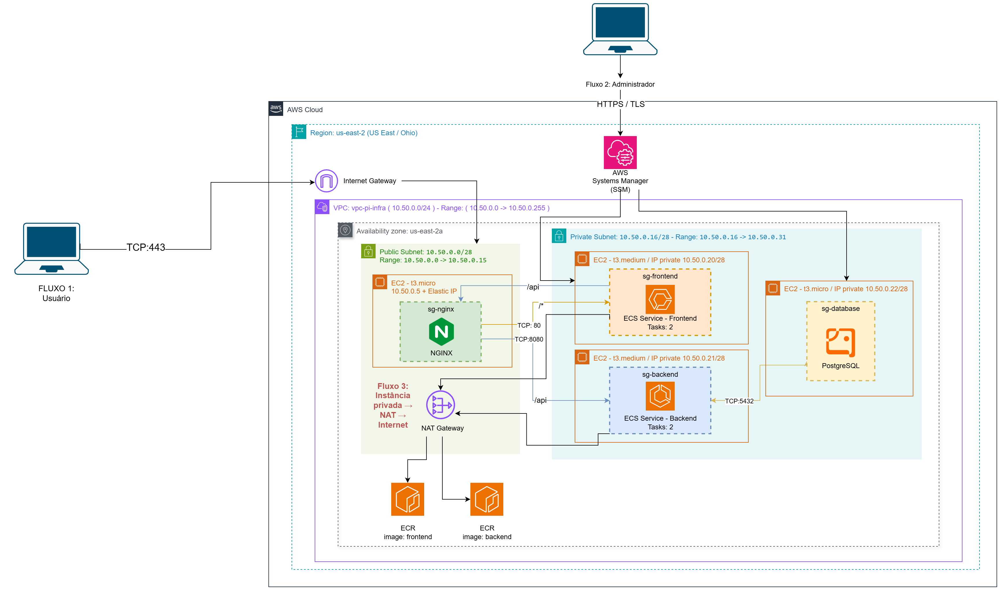

# Descrição da Aplicação e Arquitetura

## 5.1 Descrição da aplicação

A aplicação é um sistema web para gerenciamento e reserva de aluguel de carros. Ela resolve a burocracia do controle manual de frotas e a falta de transparência no cálculo de valores, automatizando a gestão de veículos para a empresa e permitindo que os clientes calculem custos em tempo real, façam reservas online e acompanhem seu histórico de locações.

### Perfis de Usuários
O sistema possui dois tipos de usuários com permissões distintas:

* **Administrador:** Responsável pela manutenção e alimentação do banco de dados. Possui privilégios de acesso para gerenciar a maioria das rotas administrativas do sistema.
* **Locatário:** Cliente final que utiliza o sistema para visualizar o catálogo de veículos disponíveis, simular o valor final do aluguel de acordo com o período selecionado, efetivar a reserva e consultar seu histórico de locações.

### Funcionalidades Principais
* **Gestão de Frota (Admin):** Cadastro, atualização e controle de status dos veículos disponíveis.
* **Controle de Acesso:** Autenticação e autorização diferenciando as rotas de administrador e locatário.
* **Simulação e Cálculo de Aluguel:** Ferramenta que calcula o valor total da reserva com base nas diárias/período escolhido pelo locatário.
* **Aluguel de Carros:** Fluxo para o locatário confirmar o aluguel do veículo selecionado.
* **Histórico de Locações:** Painel no qual o locatário acompanha suas reservas passadas e ativas.

### Componentes Técnicos
A aplicação adota uma arquitetura em camadas desacoplada (cliente-servidor via API RESTful):

* **Frontend:** Desenvolvido em **React** com o empacotador **Vite**, responsável por renderizar uma interface dinâmica, leve e responsiva no navegador do usuário (*Single Page Application*).
* **Backend:** Desenvolvido em **Java** com **Spring Boot**, responsável pelas regras de negócio, rotas REST e segurança. Utiliza **Spring Security** em conjunto com **JWT** (JSON Web Tokens) para autenticação stateless e controle de autorização baseado em perfis (RBAC).
* **Banco de Dados:** **PostgreSQL**, banco relacional responsável pela persistência durável dos dados da aplicação (usuários, veículos, alugueis e auditoria de ações).

---

### Requisitos Não-Funcionais Assumidos

* **RNF01 – Usuários Simultâneos:** O sistema foi dimensionado para suportar até **50 usuários simultâneos** em regime normal de operação (cenário compatível com uma empresa local de aluguel de carros de pequeno a médio porte).

* **RNF02 – Disponibilidade Esperada:** O sistema almeja um nível de disponibilidade estimado em **99,0%** em ambiente de execução regular. **Análise de Alta Disponibilidade (HA):** a arquitetura **não oferece alta disponibilidade**. Frontend e backend executam 2 tasks cada no Amazon ECS, com o Nginx distribuindo o tráfego entre elas, mas essa redundância protege apenas contra a falha de um container: as duas tasks de cada camada rodam no mesmo host EC2, e todos os recursos (Nginx, hosts ECS, banco e NAT Gateway) ficam em uma única zona de disponibilidade (`us-east-2a`). Os pontos únicos de falha estão listados na seção 5.10.

* **RNF03 – Tempo de Resposta:** As consultas ao catálogo de veículos e o cálculo do valor da locação devem retornar respostas para o *frontend* em um tempo máximo de **2 segundos** para requisições sob carga normal.

* **RNF04 – Autenticação e Autorização:** A autenticação do sistema deve ser realizada via tokens JWT transmitidos no cabeçalho das requisições HTTP, garantindo que apenas usuários com a role de Admin acessem as rotas protegidas.

* **RNF05 – Criptografia de Credenciais:** As senhas dos usuários devem ser armazenadas no PostgreSQL de forma segura usando algoritmo de *hash* (como BCrypt), nunca em texto plano.

* **RNF06 – Interface Responsiva:** O *frontend* deve se adaptar adequadamente a telas de computadores e dispositivos móveis.

## 5.2 Diagrama de arquitetura

Fonte editável: [`diagramas/arquitetura.drawio`](diagramas/arquitetura.drawio) (draw.io / diagrams.net).

O diagrama representa a AWS na região `us-east-2` (Ohio), zona de disponibilidade `us-east-2a`, com a VPC `vpc-pi-infra` (`10.50.0.0/24`), a sub-rede pública `pb-subnet` (`10.50.0.0/28`) e a sub-rede privada `pv-subnet` (`10.50.0.16/28`). Cada instância aparece com seu tipo, seu IP e o grupo de segurança aplicado. A única instância com IP público (Elastic IP) é a do Nginx.

### Fluxos numerados

1. **Fluxo 1 — Usuário final acessando a aplicação:** o navegador do usuário envia uma requisição HTTPS (TCP 443) para o Elastic IP do Nginx, passando pelo Internet Gateway. O Nginx (`sg-nginx`, sub-rede pública) encaminha as rotas `/*` para o ECS Service do frontend (TCP 80, `sg-frontend`) e as rotas `/api` para o ECS Service do backend (TCP 8080, `sg-backend`), ambos na sub-rede privada. O backend consulta o PostgreSQL (TCP 5432, `sg-database`), e a resposta volta pelo mesmo caminho.
2. **Fluxo 2 — Administrador acessando via SSH:** o administrador se autentica na AWS (IAM) e abre uma sessão no AWS Systems Manager Session Manager por HTTPS/TLS. O SSM Agent de cada instância mantém uma conexão de saída (TCP 443) com os endpoints da AWS, pelo Internet Gateway no caso do Nginx e pelo NAT Gateway no caso das instâncias privadas. O SSH é feito por um túnel sobre essa sessão (`ssh` com `ProxyCommand` do SSM), sem nenhuma porta 22 aberta nos grupos de segurança (ver ADR-001).
3. **Fluxo 3 — Instância privada acessando a internet pelo NAT:** os hosts ECS e a instância do PostgreSQL, sem IP público, enviam o tráfego destinado à internet (pull de imagens no Amazon ECR, atualizações do sistema operacional, comunicação do SSM Agent) para o NAT Gateway na sub-rede pública, conforme a rota `0.0.0.0/0` da `pv-subnet-rt`. O NAT Gateway traduz o endereço de origem para o seu IP público e encaminha o tráfego ao Internet Gateway. As respostas retornam pelo mesmo caminho, e nenhuma conexão iniciada na internet consegue alcançar as instâncias privadas.

## 5.3 Plano de Endereçamento IP

| Recurso | Nome | CIDR | Faixa de IP | Zona | Tipo | Finalidade |
| :--- | :--- | :--- | :--- | :--- | :--- | :--- |
| **VPC - Rede Virtual Privada** | `vpc-pi-infra` | `10.50.0.0/24` | `10.50.0.0 -> 10.50.0.255` | `us-east-2` | - | Rede Privada do Projeto |
| **Sub-rede da VPC** | `pb-subnet` | `10.50.0.0/28` | `10.50.0.0 -> 10.50.0.15` | `us-east-2a` | Pública | Proxy reverso Nginx (Elastic IP) e NAT Gateway |
| **Sub-rede da VPC** | `pv-subnet` | `10.50.0.16/28` | `10.50.0.16 -> 10.50.0.31` | `us-east-2a` | Privada | Frontend, Backend, Banco de dados |

### Justificativa dos tamanhos e endereços reservados

A AWS reserva **5 endereços em cada sub-rede**: o endereço de rede, o roteador da VPC (`.1`), o DNS da AWS (`.2`), um endereço reservado para uso futuro (`.3`) e o endereço de broadcast (último). Assim, cada sub-rede `/28` (16 endereços) tem **11 endereços utilizáveis**:

| Sub-rede | Endereços reservados pela AWS | Utilizáveis | Em uso no projeto |
|---|---|---|---|
| `pb-subnet` (`10.50.0.0/28`) | `.0`, `.1`, `.2`, `.3`, `.15` | `.4` a `.14` (11) | Nginx (`10.50.0.5`) e NAT Gateway: 2 endereços |
| `pv-subnet` (`10.50.0.16/28`) | `.16`, `.17`, `.18`, `.19`, `.31` | `.20` a `.30` (11) | Host ECS frontend (`.20`), host ECS backend (`.21`) e PostgreSQL (`.22`): 3 endereços |

- **Sub-redes `/28`:** é o menor bloco aceito pela AWS. Cada sub-rede terá no máximo 3 recursos, e os 11 endereços utilizáveis deixam folga para recriar instâncias e acrescentar componentes sem desperdiçar faixa.
- **VPC `/24`:** com 256 endereços, comporta 16 sub-redes `/28`. Hoje só 2 são usadas, o que deixa espaço para as sub-redes de uma segunda zona de disponibilidade na proposta de alta disponibilidade da Entrega 2, sem precisar recriar a VPC.
- **Faixa `10.50.0.0`:** faixa privada (RFC 1918), sem sobreposição entre as sub-redes.

## 5.4 Tabelas de Roteamento

As tabelas de roteamento definem as regras de encaminhamento do tráfego IP dentro da VPC `vpc-pi-infra`

### 1. Tabela de Rotas da Sub-rede Pública (`pb-subnet-rt`)
permite que instâncias como o proxy NGINX tenham conectividade bidirecional direta com a internet.

| Destino | Alvo (*Target*) | Descrição / Finalidade |
| :--- | :--- | :--- |
| `10.50.0.0/24` | `local` | Roteamento interno entre todos os recursos pertencentes à VPC |
| `0.0.0.0/0` | `Internet Gateway` | Encaminha todo o tráfego destinado à internet pública através do Internet Gateway |

---

### 2. Tabela de Rotas da Sub-rede Privada (`pv-subnet-rt`)
Esta tabela está associada à sub-rede privada `10.50.0.16/28` (`pv-subnet`), onde residem os serviços de *Frontend*, *Backend* e o banco de dados PostgreSQL.

| Destino | Alvo (*Target*) | Descrição / Finalidade |
| :--- | :--- | :--- |
| `10.50.0.0/24` | `local` | Roteamento interno entre os componentes privados e públicos da VPC. |
| `0.0.0.0/0` | `NAT Gateway` | Permite que as instâncias privadas iniciem conexões de saída para a internet através do NAT Gateway. |

---

### Impacto da Ausência da Rota para o NAT Gateway

Se a rota padrão (`0.0.0.0/0`) apontando para o NAT Gateway for removida da sub-rede privada, os recursos nela localizados perderão completamente o acesso de saída para a internet, deixando-os impossibilitados de baixar qualquer coisa da internet. Isso causará os seguintes impactos:

1. **Falha ao baixar imagens de contêiner no ECR:** Os nós do Amazon ECS na sub-rede privada não conseguirão realizar o *pull* das imagens Docker registradas nos repositórios.

2. **Impossibilidade de atualização de pacotes e SO:** A instância EC2 do PostgreSQL e os nós do ECS ficarão impossibilitados de efetuar atualizações de segurança do sistema operacional.

3. **Perda de gerenciamento remoto via AWS Systems Manager (SSM):** A gestão remota realizada pelo AWS Systems Manager em direção às instâncias privadas será interrompida, pois o agente do SSM precisa de conexão de saída para comunicar com os *endpoints* da AWS.

## 5.5 Matriz de regras de segurança

O acesso administrativo é feito exclusivamente pelo **AWS Systems Manager (Session Manager)**. O agente SSM, instalado nas instâncias, abre uma conexão de saída (HTTPS/443) até os endpoints da AWS, então nenhum grupo de segurança possui regra de entrada para SSH (porta 22). O SSH nunca é liberado para `0.0.0.0/0`.

| Grupo de segurança | Direção | Protocolo | Porta | Origem/Destino | Justificativa |
|---|---|---|---|---|---|
| sg-nginx | Entrada | TCP | 443 | `0.0.0.0/0` | Fluxo 1: usuários acessam a aplicação via HTTPS. É o único ponto de entrada pública da arquitetura. |
| sg-nginx | Saída | TCP | 80 | sg-frontend | Encaminha as rotas `/*` ao frontend. |
| sg-nginx | Saída | TCP | 8080 | sg-backend | Encaminha as rotas `/api` ao backend. |
| sg-nginx | Saída | TCP | 443 | `0.0.0.0/0` | O SSM Agent e as atualizações do SO acessam endpoints da AWS pelo Internet Gateway (a instância tem IP público). |
| sg-frontend | Entrada | TCP | 80 | sg-nginx | Somente o proxy acessa o frontend. |
| sg-frontend | Saída | TCP | 443 | `0.0.0.0/0` (via NAT Gateway) | Pull da imagem no ECR, SSM Agent e envio de logs. |
| sg-backend | Entrada | TCP | 8080 | sg-nginx | Somente o proxy chama a API. O frontend não acessa o backend diretamente. |
| sg-backend | Saída | TCP | 5432 | sg-database | Conexão com o PostgreSQL. |
| sg-backend | Saída | TCP | 443 | `0.0.0.0/0` (via NAT Gateway) | Pull da imagem no ECR, SSM Agent e envio de logs. |
| sg-database | Entrada | TCP | 5432 | sg-backend | O banco aceita conexões apenas do backend. |
| sg-database | Saída | TCP | 443 | `0.0.0.0/0` (via NAT Gateway) | Exclusivo para o SSM Agent e atualizações do SO. |

## 5.6 Tecnologias

| Camada | Tecnologia | Versão | Justificativa |
|---|---|---|---|
| Provedor e região | AWS — us-east-2 (Ohio) | - | Região escolhida por apresentar o menor custo de infraestrutura da AWS. O valor de recursos como instâncias EC2 e NAT Gateway em Ohio (us-east-2) garante a menor tarifação mensal possível, otimizando o orçamento do projeto acadêmico. Como o ambiente destina-se a uma entrega/demonstração acadêmica e a carga prevista é reduzida (50 usuários simultâneos), o acréscimo de latência entre o Brasil e os EUA foi aceito conscientemente como um trade-off viável, priorizando a economia de custos acima da resposta em milissegundos sem comprometer o funcionamento da aplicação |
| Sistema operacional (hosts ECS) | Amazon Linux 2023 (AMI ECS-Optimized) | 2023 | Usada nos dois hosts ECS (frontend e backend). Imagem mantida pela AWS, já com Docker Engine e o agente do ECS pré-instalados e atualizados, dispensando provisionamento manual (cloud-init) no host que roda os containers. Inclui o SSM Agent nativamente, necessário para o acesso administrativo via Systems Manager sem bastion. |
| Sistema operacional (Nginx e PostgreSQL) | Amazon Linux 2023 (AMI padrão) | 2023 | Usada nas instâncias do Nginx e do PostgreSQL, que não executam containers do ECS e por isso não precisam do Docker nem do agente do ECS. Mantém a mesma distribuição dos hosts ECS (mesmo gerenciador de pacotes `dnf`) e também traz o SSM Agent pré-instalado. |
| Orquestração de containers | Amazon ECS — launch type EC2 | - | O ECS permite declarar task definitions que apontam direto para as imagens de frontend e backend, sem etapa de build na infraestrutura. O launch type EC2 foi escolhido no lugar do Fargate para manter controle sobre o dimensionamento e o custo da instância hospedeira, em vez do modelo de cobrança por vCPU/memória do Fargate. Frontend e backend rodam em hosts ECS separados, isolando o consumo de recursos de cada camada. |
| Registro de imagens | Amazon ECR (Elastic Container Registry) | - | Repositório privado gerenciado pela AWS para as imagens de frontend e backend, na mesma região do projeto, integrado nativamente às permissões IAM das instâncias ECS. Como os hosts ECS estão na sub-rede privada e o projeto não usa VPC endpoints, o pull das imagens sai pelo NAT Gateway (Fluxo 3), e esse volume é cobrado como dados processados pelo NAT (seção 5.9). |
| Runtime / backend | Java / Spring Boot | 24 | API de regras de negócio, containerizada e isolada em sub-rede privada. O reuso da imagem pré-compilada no Amazon ECR evitou a reescrita do código, garantindo a integração com o PostgreSQL e acelerando o deploy|
| Runtime / frontend | React | 19.2.8 | Aplicação SPA em React compilada como build estático (HTML/JS/CSS) e servida diretamente pelo Nginx. Essa abordagem elimina a necessidade de um servidor Node.js em produção, economizando memória e CPU da instância EC2. Como a imagem Docker já estava pronta no ECR, seu reuso otimizou o tempo de deploy |
| Servidor web / proxy | Nginx | 1.26 | Único ponto de entrada público da arquitetura: encaminha `/` para o frontend e `/api` para o backend, ambos em sub-rede privada, e concentra o Elastic IP, evitando expor as instâncias de aplicação diretamente à internet. |
| Banco de dados | PostgreSQL | 16 | Banco relacional self-managed em EC2 (ver ADR-003), compatível com o driver JDBC já usado pelo backend Spring Boot. |
| Infraestrutura como código | Terraform | ~> 1.9 | Ferramenta padrão de mercado com provider oficial maduro para AWS; escolhida no lugar do OpenTofu por familiaridade do grupo. |
| Provider do Terraform | hashicorp/aws | ~> 5.0 | Provider oficial da HashiCorp, com suporte completo aos recursos exigidos (VPC, sub-redes, NAT Gateway, Security Groups, EC2, Elastic IP). |
| Instalação da aplicação | ECS task definitions (pull direto do Amazon ECR) | - | Como as imagens de frontend e backend já estão publicadas no ECR, a instalação não exige script de build nem Ansible: o ECS Agent apenas puxa a imagem do registro privado e sobe o container conforme a task definition, o que também simplifica recriar o ambiente entre sessões de teste |

## 5.7 Dimensionamento das instâncias

O requisito não funcional desta entrega é suportar 50 usuários simultâneos sem exigência estrita de alta disponibilidade, priorizando o menor custo mensal.

Para isso, todas as instâncias usam a família t3 (CPU baseada em créditos). Essa arquitetura é ideal para o projeto: as instâncias acumulam créditos computacionais durante a ociosidade e os utilizam para entregar picos de CPU (burstable performance) nos momentos de tráfego. Isso garante fluidez e estabilidade para os 50 usuários com um custo muito inferior ao de instâncias de capacidade fixa.

| Componente | Família | Tipo | vCPU | Memória | Disco (tipo e tamanho) | Sub-rede | Justificativa |
|---|---|---|---|---|---|---|---|
| Nginx (proxy público) | t3 (CPU baseada em créditos) | t3.micro | 2 | 1 GiB | gp3, 8 GiB | Pública (com Elastic IP) | Atua exclusivamente como proxy reverso. A instância garante a memória (1 GiB) necessária para gerenciar conexões concorrentes e buffers do Nginx com estabilidade para a carga de 50 usuários, aproveitando os picos de CPU (burstable) quando há aumento súbito de tráfego. **Tamanho menor descartado:** o t3.nano tem apenas 512 MiB, pouco para o sistema operacional, o SSM Agent e os buffers de proxy de 50 conexões simultâneas. **Disco:** 8 GiB é o tamanho do snapshot da AMI Amazon Linux 2023, o mínimo aceito para o volume raiz. **Sem créditos de CPU:** a instância não é desligada; ela passa a operar no baseline de 10% de cada vCPU, e as requisições ficam mais lentas até os créditos se acumularem de novo. |
| Host ECS — Frontend (2 tasks) | t3 (CPU baseada em créditos) | t3.medium | 2 | 4 GiB | gp3, 30 GiB | Privada | Hospeda as duas réplicas do frontend, mantendo esta camada isolada do processamento de negócio. A capacidade de 4 GiB fornece um ambiente com ampla folga de memória para o sistema operacional, ECS Agent e a execução dos containers, prevenindo qualquer concorrência de recursos. **Tamanho menor descartado:** o consumo do frontend estático é leve e o t3.small (2 GiB) atenderia à carga, mas o grupo optou pelo t3.medium para manter folga confortável de memória para o SO, o ECS Agent e as duas réplicas, aceitando o custo maior (ponto de redução de custo para a Entrega 2). **Disco:** 30 GiB é o tamanho do snapshot da AMI ECS-Optimized, o mínimo aceito, e comporta as imagens Docker baixadas do ECR. **Sem créditos de CPU:** o host passa ao baseline de 20% de cada vCPU; o impacto é baixo, porque servir arquivos estáticos consome pouca CPU. |
| Host ECS — Backend (2 tasks) | t3 (CPU baseada em créditos) | t3.medium | 2 | 4 GiB | gp3, 30 GiB | Privada | Dedicada às duas réplicas da API em Spring Boot. Por ser baseada em Java, cada container exige uma reserva de memória considerável. Os 4 GiB garantem a operação segura de ambos os containers simultaneamente, sem risco de queda por falta de memória, deixando margem para o SO. **Tamanho menor descartado:** o t3.small (2 GiB) deixaria pouco espaço para duas JVMs (cerca de 512 MiB a 1 GiB de heap cada) mais o SO e o ECS Agent, com risco de o container ser encerrado por falta de memória (OOM kill). **Disco:** 30 GiB, mínimo da AMI ECS-Optimized. **Sem créditos de CPU:** o host passa ao baseline de 20% de cada vCPU; os containers continuam no ar, mas o tempo de resposta da API aumenta e pode passar do limite de 2 segundos do RNF03 em picos prolongados. |
| PostgreSQL | t3 (CPU baseada em créditos) | t3.micro | 2 | 1 GiB | gp3, 8 GiB | Privada | Configuração ideal para o volume de dados do escopo acadêmico. A memória atende eficientemente ao cache e aos shared buffers do banco para a carga estimada, enquanto o disco gp3 de 8 GiB oferece espaço abundante e seguro para o armazenamento, mantendo o ambiente otimizado e com baixo custo mensal. **Tamanho menor descartado:** o t3.nano (512 MiB) não comporta com segurança o PostgreSQL 16 com conexões vindas de duas réplicas do backend. **Disco:** 8 GiB é também o mínimo da AMI Amazon Linux 2023. **Sem créditos de CPU:** as consultas passam a rodar no baseline de 10% de cada vCPU, aumentando a latência das consultas mais pesadas, sem indisponibilidade (risco relacionado ao item 2 da seção 5.10). |

## 5.8 Registros de Decisão Arquitetural (ADRs)

As decisões estão registradas no formato Y-statement, um arquivo por decisão, em [`docs/adr/`](adr/):

- [ADR-001: Estratégia de acesso administrativo](adr/001-acesso-administrativo.md)
- [ADR-002: Saída para a internet da sub-rede privada](adr/002-saida-internet-subrede-privada.md)
- [ADR-003: Localização do banco de dados](adr/003-localizacao-banco.md)

## 5.9 Estimativa de custos

A estimativa completa está em [`custos/estimativa.md`](custos/estimativa.md), e a exportação da AWS Pricing Calculator está em [`custos/estimativa.pdf`](custos/estimativa.pdf). Ela contém os dois cenários (A: operação contínua, 730 h/mês; B: período de trabalho da Entrega 2), os itens de custo com o mais caro identificado (NAT Gateway), a proposta de redução, o uso do nível gratuito e o plano de controle de custos.

## 5.10 Riscos e limitações

| # | Ponto de falha ou limitação | Impacto | Mitigação possível (Entrega 2) |
|---|---|---|---|
| 1 | **Zona de disponibilidade única.** Todos os recursos (Nginx, hosts ECS, banco e NAT) estão em `us-east-2a`. | Uma falha na zona (energia, rede, datacenter) derruba toda a aplicação. Também não há redundância regional: usuários distantes de `us-east-2` têm maior latência. | Distribuir hosts ECS e banco em uma segunda AZ. Multi-região reduziria a latência e aumentaria a resiliência, mas é a opção mais cara e não será adotada. |
| 2 | **Banco PostgreSQL instalado diretamente numa única EC2 `t3.micro`.** Não é serviço gerenciado nem serverless. | Se a instância ou o serviço do PostgreSQL falhar, o banco fica indisponível até a recuperação manual. Não há failover, backup automático nem escala. Os dados dependem do disco da instância e podem ser perdidos ao destruir e recriar o ambiente (seção 5.9). | Migrar para Amazon RDS (Multi-AZ), Aurora Serverless ou outra solução serverless da AWS. |
| 3 | **Redundância apenas em nível de container.** Frontend e backend têm 2 tasks, mas cada serviço roda em um único host EC2 (`10.50.0.20` e `10.50.0.21`). | A falha do host derruba o serviço inteiro, apesar das duas tasks. | Distribuir os hosts ECS em mais de uma AZ, com as tasks espalhadas entre eles. |

A arquitetura **não oferece alta disponibilidade** atualmente. A tabela acima identifica os principais pontos únicos de falha e limitações do sistema, e esta lista será o ponto de partida da proposta de alta disponibilidade da próxima entrega.

Caso alguma das mitigações propostas não possa ser aplicada (por custo, complexidade ou outro motivo), a decisão e sua justificativa serão documentadas na Entrega 2.
